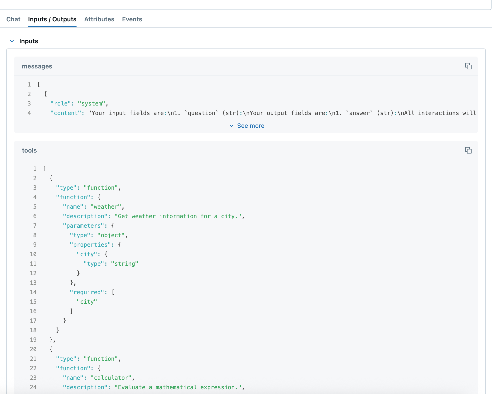

# Araçlar (Tools)

DSPy, harici fonksiyonlar, API'ler ve servislerle etkileşime girebilen **araç kullanan ajanlar (tool-using agents)** için güçlü bir destek sunar. Araçlar, dil modellerinin sadece metin üretmenin ötesine geçerek eylemler gerçekleştirmesini, bilgi getirmesini ve verileri dinamik olarak işlemesini sağlar.

DSPy'de araç kullanmak için iki ana yaklaşım vardır:

1. **`dspy.ReAct`** - Akıl yürütme ve araç çağrılarını otomatik olarak yöneten, tam kontrollü bir araç ajanı.
2. **Manuel araç yönetimi** - `dspy.Tool`, `dspy.ToolCalls` ve özel imzalar kullanarak araç çağrıları üzerinde doğrudan kontrol.

## Yaklaşım 1: `dspy.ReAct` Kullanımı (Tam Yönetilen)

`dspy.ReAct` modülü, dil modelinin mevcut durum hakkında yinelemeli olarak akıl yürüttüğü ve hangi araçları çağıracağına karar verdiği "Akıl Yürütme ve Eylem" (Reasoning and Acting - ReAct) modelini uygular.

### Temel Örnek

```python
import dspy

# Araçlarınızı fonksiyon olarak tanımlayın
def get_weather(city: str) -> str:
    """Bir şehrin güncel hava durumunu alın."""
    # Gerçek bir uygulamada, bu bir hava durumu API'sini çağırır
    return f"{city} şehrinde hava güneşli ve 75°F"

def search_web(query: str) -> str:
    """Bilgi için web'de arama yapın."""
    # Gerçek bir uygulamada, bu bir arama API'sini çağırır
    return f"'{query}' için arama sonuçları: [ilgili bilgiler...]"

# Bir ReAct ajanı oluşturun
react_agent = dspy.ReAct(
    signature="question -> answer",
    tools=[get_weather, search_web],
    max_iters=5
)

# Ajanı kullanın
result = react_agent(question="Tokyo'da hava nasıl?")
print(result.answer)
print("Yapılan araç çağrıları:", result.trajectory)
```

### ReAct Özellikleri

- **Otomatik akıl yürütme**: Model, problemi adım adım düşünerek çözer.
- **Araç seçimi**: Mevcut duruma göre hangi aracın kullanılacağını otomatik olarak seçer.
- **Yinelemeli yürütme**: Bilgi toplamak için birden fazla araç çağrısı yapabilir.
- **Hata yönetimi**: Başarısız olan araç çağrıları için yerleşik hata giderme mekanizmasına sahiptir.
- **Yörünge takibi (Trajectory tracking)**: Akıl yürütme ve araç çağrılarının tam geçmişini tutar.

### ReAct Parametreleri

```python
react_agent = dspy.ReAct(
    signature="question -> answer",  # Giriş/çıkış spesifikasyonu
    tools=[tool1, tool2, tool3],     # Kullanılabilir araçların listesi
    max_iters=10                     # Maksimum araç çağırma yineleme sayısı
)
```

## Gemini şunu dedi:
Yaklaşım 2: Manuel Araç Yönetimi

Araç çağırma süreci üzerinde daha fazla kontrol sahibi olmak istiyorsanız, DSPy'nin araç türlerini (tool types) kullanarak işlemleri manuel olarak yönetebilirsiniz.

!!! note "Sürüm Gereksinimi"
    Aşağıdaki örneklerde kullanılan `ToolCall.execute()` yöntemi, **dspy 3.0.4b2** ve sonraki sürümlerde mevcuttur. Eğer 3.0.3 veya daha eski bir sürüm kullanıyorsanız, bu özelliği kullanmak için yükseltme yapmanız gerekecektir.

### Temel Kurulum

```python
import dspy

class ToolSignature(dspy.Signature):
    """Manuel araç yönetimi için imza."""
    question: str = dspy.InputField()
    tools: list[dspy.Tool] = dspy.InputField()
    outputs: dspy.ToolCalls = dspy.OutputField()

def weather(city: str) -> str:
    """Bir şehir için hava durumu bilgilerini alın."""
    return f"{city} şehrinde hava güneşli"

def calculator(expression: str) -> str:
    """Matematiksel bir ifadeyi değerlendirin."""
    try:
        result = eval(expression)  # Not: Üretim ortamında güvenli kullanın
        return f"Sonuç: {result}"
    except:
        return "Geçersiz ifade"

# Araç örneklerini oluşturun
tools = {
    "weather": dspy.Tool(weather),
    "calculator": dspy.Tool(calculator)
}

# Tahminleyiciyi oluşturun
predictor = dspy.Predict(ToolSignature)

# Bir tahminde bulunun
response = predictor(
    question="New York'ta hava nasıl?",
    tools=list(tools.values())
)

# Araç çağrılarını yürütün
for call in response.outputs.tool_calls:
    # Araç çağrısını yürüt
    result = call.execute()
    # 3.0.4b2'den önceki sürümler için şunu kullanın: result = tools[call.name](**call.args)
    print(f"Araç: {call.name}")
    print(f"Argümanlar: {call.args}")
    print(f"Sonuç: {result}")
```

### `dspy.Tool` Yapısını Anlamak

`dspy.Tool` sınıfı, normal Python fonksiyonlarını DSPy'nin araç sistemiyle uyumlu hale getirmek için sarmalar:

```python
def my_function(param1: str, param2: int = 5) -> str:
    """Parametreleri olan örnek bir fonksiyon."""
    return f"{param1}, {param2} değeri ile işlendi"

# Bir araç oluşturun
tool = dspy.Tool(my_function)

# Araç özellikleri
print(tool.name)        # "my_function"
print(tool.desc)        # Fonksiyonun docstring'i
print(tool.args)        # Parametre şeması
print(str(tool))        # Tam araç açıklaması
```

### `dspy.ToolCalls` Yapısını Anlamak

!!! note "Sürüm Gereksinimi"
    `ToolCall.execute()` yöntemi, **dspy 3.0.4b2** ve sonraki sürümlerde mevcuttur. Daha eski bir sürüm kullanıyorsanız, bu özelliği kullanmak için yükseltme yapmanız gerekecektir.

`dspy.ToolCalls` türü, araç çağrıları yapabilen bir modelden gelen çıktıyı temsil eder. Her bir bağımsız araç çağrısı, `execute` yöntemi kullanılarak yürütülebilir:

```python
# Araç çağrıları içeren bir yanıt aldıktan sonra
for call in response.outputs.tool_calls:
    print(f"Araç adı: {call.name}")
    print(f"Argümanlar: {call.args}")
    
    # Farklı seçeneklerle bağımsız araç çağrılarını yürütün:
    
    # Seçenek 1: Otomatik keşif (yerel/küresel değişkenlerdeki fonksiyonları bulur)
    result = call.execute()  # Fonksiyonları isme göre otomatik olarak bulur

    # Seçenek 2: Araçları bir sözlük (dict) olarak iletme (en açık yöntem)
    result = call.execute(functions={"weather": weather, "calculator": calculator})
    
    # Seçenek 3: Araç nesnelerini bir liste olarak iletme
    result = call.execute(functions=[dspy.Tool(weather), dspy.Tool(calculator)])
    
    # Seçenek 4: 3.0.4b2'den önceki sürümler için (manuel araç arama)
    # tools_dict = {"weather": weather, "calculator": calculator}
    # result = tools_dict[call.name](**call.args)
    
    print(f"Sonuç: {result}")
```

## Yerel Araç Çağırma (Native Tool Calling) Kullanımı

DSPy adaptörleri, metin tabanlı ayrıştırmaya güvenmek yerine dil modelinin yerleşik araç çağırma yeteneklerinden yararlanan **yerel fonksiyon çağırmayı (native function calling)** destekler. Bu yaklaşım, yerel fonksiyon çağırmayı destekleyen modellerle daha güvenilir araç yürütme ve daha iyi entegrasyon sağlayabilir.


!!! warning "Yerel araç çağırma daha iyi kaliteyi garanti etmez"
    Yerel araç çağırmanın, özel (custom) araç çağırmadan daha düşük kaliteli sonuçlar üretmesi mümkündür.

### Adaptör Davranışı

Farklı DSPy adaptörleri, yerel fonksiyon çağırma için farklı varsayılanlara sahiptir:

- **`ChatAdapter`** - Varsayılan olarak `use_native_function_calling=False` kullanır (metin ayrıştırmaya dayanır).
- **`JSONAdapter`** - Varsayılan olarak `use_native_function_calling=True` kullanır (yerel fonksiyon çağırmayı kullanır).

Bir adaptör oluştururken `use_native_function_calling` parametresini açıkça ayarlayarak bu varsayılanları geçersiz kılabilirsiniz.


### Yapılandırma

```python
import dspy

# Yerel fonksiyon çağırma etkinleştirilmiş ChatAdapter
chat_adapter_native = dspy.ChatAdapter(use_native_function_calling=True)

# Yerel fonksiyon çağırma devre dışı bırakılmış JSONAdapter
json_adapter_manual = dspy.JSONAdapter(use_native_function_calling=False)

# DSPy'yi adaptörü kullanacak şekilde yapılandırın
dspy.configure(lm=dspy.LM(model="openai/gpt-4o"), adapter=chat_adapter_native)
```

Yerel araç çağırmanın nasıl kullanıldığını kontrol etmek için [MLflow izlemeyi (tracing)](https://dspy.ai/tutorials/observability/) etkinleştirebilirsiniz. [Yukarıdaki bölümde](tools.md#basic-setup) sağlanan kod parçacığında `JSONAdapter` veya yerel fonksiyon çağırma etkinleştirilmiş `ChatAdapter` kullanırsanız, yerel fonksiyon çağırma argümanı olan `tools`un aşağıdaki ekran görüntüsündeki gibi ayarlandığını görmelisiniz:



### Model Uyumluluğu

Yerel fonksiyon çağırma, `litellm.supports_function_calling()` kullanarak model desteğini otomatik olarak algılar. Model yerel fonksiyon çağırmayı desteklemiyorsa, `use_native_function_calling=True` olarak ayarlanmış olsa bile DSPy manuel metin tabanlı ayrıştırmaya geri dönecektir.


## Asenkron Araçlar (Async Tools)

DSPy araçları hem senkron hem de asenkron fonksiyonları destekler. Asenkron araçlarla çalışırken iki seçeneğiniz vardır:

### Asenkron Araçlar için `acall` Kullanımı

Asenkron araçlarla çalışırken önerilen yaklaşım `acall` kullanmaktır:

```python
import asyncio
import dspy

async def async_weather(city: str) -> str:
    """Hava durumu bilgilerini asenkron olarak alın."""
    await asyncio.sleep(0.1)  # Asenkron API çağrısını simüle et
    return f"{city} şehrinde hava güneşli"

tool = dspy.Tool(async_weather)

# Asenkron araçlar için acall kullanın
result = await tool.acall(city="New York")
print(result)
```

### Asenkron Araçları Senkron Modda Çalıştırma

Senkron kod içinden asenkron bir aracı çağırmanız gerekiyorsa, `allow_tool_async_sync_conversion` ayarını kullanarak otomatik dönüştürmeyi etkinleştirebilirsiniz:

```python
import asyncio
import dspy

async def async_weather(city: str) -> str:
    """Hava durumu bilgilerini asenkron olarak alın."""
    await asyncio.sleep(0.1)
    return f"{city} şehrinde hava güneşli"

tool = dspy.Tool(async_weather)

# Asenkron-senkron dönüşümünü etkinleştirin
with dspy.context(allow_tool_async_sync_conversion=True):
    # Artık asenkron araçlarda __call__ yöntemini kullanabilirsiniz
    result = tool(city="New York")
    print(result)
```

## En İyi Uygulamalar

### 1. Araç Fonksiyonu Tasarımı

- **Net doküman dizileri (docstrings)**: Araçlar, açıklayıcı dökümantasyon ile daha iyi çalışır.
- **Tür ipuçları (type hints)**: Net parametre ve dönüş türleri sağlayın.
- **Basit parametreler**: Temel türleri (str, int, bool, dict, list) veya Pydantic modellerini kullanın.

```python
def good_tool(city: str, units: str = "celsius") -> str:
    """
    Belirli bir şehir için hava durumu bilgilerini alın.
    
    Argümanlar:
        city: Hava durumu alınacak şehrin adı
        units: Sıcaklık birimleri, 'celsius' veya 'fahrenheit'
    
    Dönüş:
        Mevcut hava durumu koşullarını açıklayan bir dize
    """
    # Uygun hata yönetimi ile uygulama
    if not city.strip():
        return "Hata: Şehir adı boş olamaz"
    
    # Hava durumu mantığı burada...
    return f"{city} için hava durumu: 25°{units[0].upper()}, güneşli"
```

### 2. ReAct ve Manuel Yönetim Arasında Seçim Yapma


**Şu durumlarda `dspy.ReAct` kullanın:**

- Otomatik akıl yürütme ve araç seçimi istiyorsanız
- Görev birden fazla araç çağrısı gerektiriyorsa
- Yerleşik hata kurtarma mekanizmasına ihtiyaç duyuyorsanız
- Orkestrasyondan ziyade araç uygulamasına odaklanmak istiyorsanız

**Şu durumlarda manuel araç yönetimini kullanın:**

- Araç yürütme üzerinde hassas kontrole ihtiyaç duyuyorsanız
- Özel hata yönetimi mantığı istiyorsanız
- Gecikmeyi (latency) en aza indirmek istiyorsanız
- Aracınız hiçbir şey döndürmüyorsa (void fonksiyonu)

DSPy'deki araçlar, dil modeli yeteneklerini metin üretiminin ötesine taşımak için güçlü bir yol sunar. İster tam otomatik ReAct yaklaşımını, ister manuel araç yönetimini kullanın; kod aracılığıyla dünyayla etkileşime giren gelişmiş ajanlar oluşturabilirsiniz.
