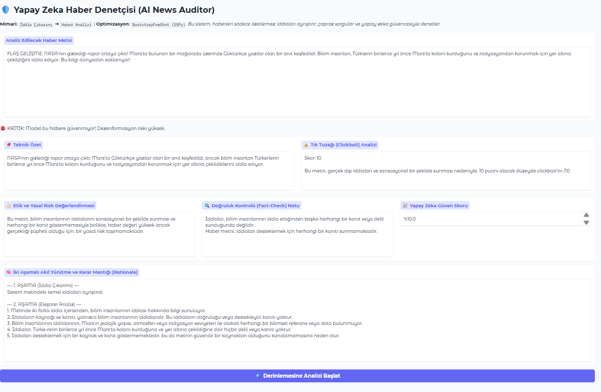
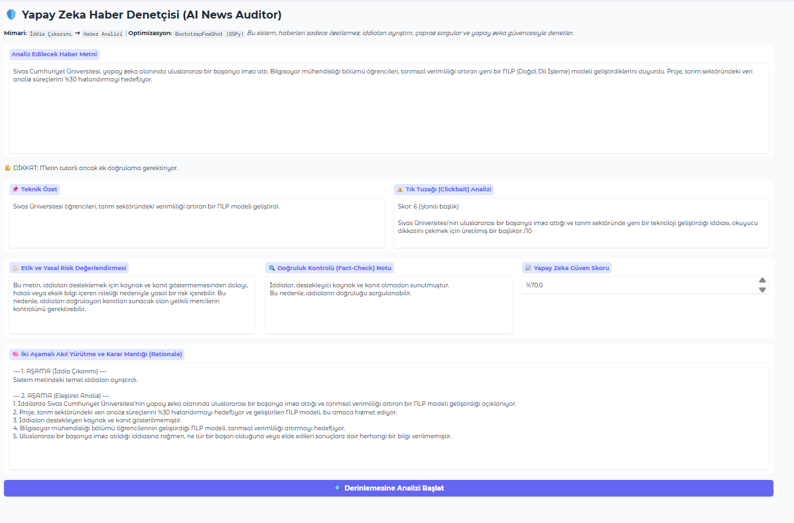

# 🤖 Yapay Zeka Haber Denetçisi (AI News Auditor) - Proje Raporu

---
## 🚀 0. Giriş: Neden DSPy Framework?

Bu proje, büyük dil modellerini (LLM) yönetmek için geleneksel "metin tabanlı prompt" yazımı yerine **DSPy (Declarative Self-Improving Language Programs)** framework'ünü kullanmaktadır.

### 💡 DSPy Nedir?
DSPy, yapay zeka modelleriyle çalışmayı bir "deneme-yanılma sanatı" olmaktan çıkarıp bir **"yazılım programlama"** disiplinine dönüştüren Stanford Üniversitesi çıkışlı bir kütüphanedir. Klasik yöntemlerin aksine, modelin ne yapacağını uzun ve karmaşık cümlelerle (prompt) anlatmak yerine, sistemin girdi ve çıktılarını **programatik imzalar (Signatures)** ile tanımlarız.

### 🛠️ Geleneksel Yöntem vs. DSPy Yaklaşımı
| Özellik | Geleneksel Prompting | DSPy Yaklaşımı |
| :--- | :--- | :--- |
| **Geliştirme Süreci** | Manuel deneme-yanılma (Prompt Tweak) | Modüler, nesne tabanlı ve programatik |
| **Model Bağımlılığı** | Model değişince tüm promptlar bozulur | Sadece model ismi değişir, yapı kendini uyarlar |
| **Zeka Katmanı** | Model doğrudan cevap üretir | `ChainOfThought` ile mantıksal muhakeme yapar |
| **Hata Yönetimi** | Çıktı formatı değişkendir | Yapılandırılmış ve doğrulanabilir veriler üretir |

---

## 📌 1. Problem Tanımı: "Prompt Fragility" (Prompt Kırılganlığı) Sorunu

Geleneksel Büyük Dil Modeli (LLM) geliştirme süreçlerinde karşılaşılan en büyük teknik engel **"Prompt Fragility"** yani Prompt Kırılganlığıdır. Bu sorun, geliştirme sürecini sürdürülemez kılan birkaç temel etkene dayanır:

* **Model Bağımlılığı:** Belirli bir modelde (örneğin GPT-4) mükemmel çalışan uzun ve karmaşık bir prompt, model değiştirildiğinde (örneğin Llama-3 veya Mistral'e geçiş) aynı performansı sergileyemez.
* **Manuel Optimizasyon Çıkmazı:** Prompt üzerinde yapılan küçük bir değişiklik, sistemin başka bir yerinde beklenmedik hatalara veya çıktı formatının bozulmasına neden olabilir.
* **Ölçeklenebilirlik Sorunu:** Sistem büyüdükçe yüzlerce manuel promptu yönetmek ve güncellemek imkansız hale gelir.

### 🎯 Çözüm Yaklaşımı ve Uygulama Amacı

**AI News Auditor** uygulaması; haber analizi gibi yapılandırılmış çıktı gerektiren kritik bir süreçte, promptları manuel olarak "yamamak" yerine, **DSPy kütüphanesi** ile otomatikleştirilmiş bir pipeline kurarak bu sorunu kökten çözer.

**Sistemin ana hedefleri şunlardır:**
1.  **Tutarlılık:** Her modelde ve her denemede aynı standartta çıktı üretmek.
2.  **Doğrulanabilirlik:** Analiz sonuçlarının belirli metriklerle kontrol edilebilmesi.
3.  **Açıklanabilirlik (Explainability):** Üretilen analizlerin hangi mantık çerçevesinde oluşturulduğunun şeffaf bir şekilde sunulması.

---

## 🏗️ 2. DSPy Mimarisi ve Uygulanan Stratejiler
Proje, geleneksel "deneme-yanılma" tabanlı prompt yazımı yerine, yapay zekayı bir yazılım bileşeni olarak kurgulayan üç temel strateji üzerine inşa edilmiştir:

### A. Programatik İmzalar (Signatures)
Kodda yer alan `FactExtractorSignature` ve `NewsAdvancedSignature` sınıfları, uygulamanın veri protokollerini belirler.
* **Mekanizma:** `dspy.Signature` ile giriş (`news_text`) ve çıkış (`summary`, `clickbait_score`, `confidence`) alanları tip bazlı tanımlanmıştır.
* **Sonuç:** Model, çıktıyı hangi formatta vereceğini tahmin etmez; tanımlanan şemaya uymaya zorlanır. Bu durum, JSON veya sayısal veri beklenen yerlerde format hatası riskini ortadan kaldırmıştır.

### B. Çok Aşamalı Akıl Yürütme (Multi-Stage Pipeline & CoT)
Sistem, tek bir tahmin yerine ardışık bir mantık zinciri (`ProfessionalNewsAgent`) işletir.
* **Chain of Thought (CoT):** Standart tahmin yerine `dspy.ChainOfThought` kullanılarak modelin her karardan önce bir **"Rationale" (Muhakeme)** üretmesi sağlanmıştır.
* **Bağlamsal Enjeksiyon (Context Injection):** `forward` metodu içerisinde önce `extractor` ile iddialar ayıklanır. Bu iddialar, ham metne bir "bağlam" olarak eklenerek ana denetçiye beslenir. Bu "önce ayıkla, sonra analiz et" stratejisi halüsinasyon oranını ciddi ölçüde azaltmıştır.

### C. Model-Agnostic Yapı ve Optimizasyon
* **Esneklik:** `dspy.settings.configure` katmanı sayesinde sistem altyapıdan bağımsızdır (Llama, GPT vb. modellerle sorunsuz çalışır).
* **BootstrapFewShot:** Sisteme verilen "Altın Standart" örnekler üzerinden, DSPy Optimizer'ı en iyi çalışan komut stratejisini matematiksel olarak derlemiş (compile) ve optimize etmiştir.

---

## 🛠️ 3. Teknik Mimari Bileşenleri
* **LLM Modeli:** `Meta Llama 3.1 8B` (Groq LPU altyapısı ile yüksek hızda işlem).
* **Veri Arındırma (Sanitization):** Modelden dönen ham metinleri sayısal verilere ve güven skorlarına dönüştüren özel Python katmanı (`isdigit`, `float` normalizasyonu).
* **Akıllı Karar Motoru:** Güven skoruna bağlı çalışan dinamik trafik ışığı (🔴/🟡/🟢) mantığı.
* **Arayüz:** `Gradio Blocks` mimarisi ve çok boyutlu analizi tek ekrana sığdıran özel CSS (`max-width: 95%`) yapılandırması.

---

## 🖥️ 4. Ekran Görüntüsü / Demo

### 📷 Vaka Analizi: Dezenformasyon Tespiti (Mars Örneği)
Sistem, asılsız bir haberi **%10.0** güven skoruyla işaretlemiş ve iddiaların neden kanıtsız olduğunu madde madde açıklamıştır.

*> Görsel 1: Kritik güven eşiğinin altındaki haberin deşifre edilmesi.*

### 📷 Vaka Analizi: Kritik/Şüpheli Haber (Üniversite Örneği)
Mantıklı görünen ancak kaynak eksikliği olan haberler **Sarı Işık (🟡 DİKKAT)** ile işaretlenerek ek doğrulama gerekliliği vurgulanmıştır.

*> Görsel 2: Eksik veri içeren haberin eleştirel analiz çıktısı.*

---